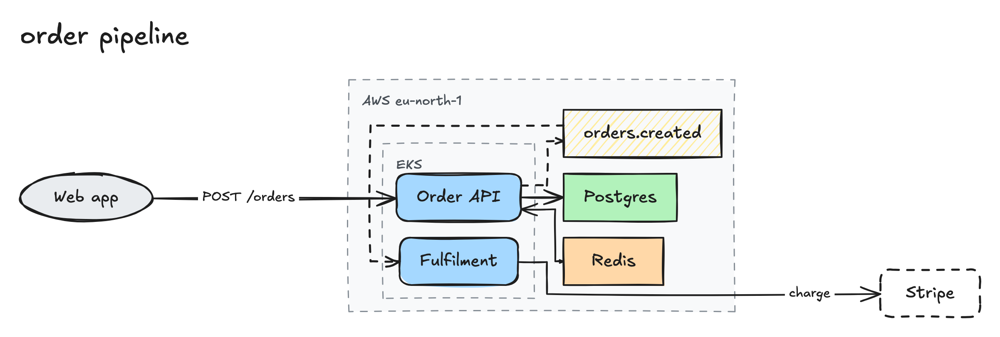

# excalix

You describe a topology, what exists and what talks to what, and excalix draws it. Everything geometric belongs to the tool: layout, the shape and colour for each kind of node, text measurement, arrow binding, element ids and seeds. Nothing visual is configurable, which is the point of the thing. The same spec always produces byte-identical output, and what lands on disk is a real `.excalidraw` file you can drop onto excalidraw.com and edit by hand, next to an SVG and a PNG.



## Install and run

```
pnpm install
pnpm exec playwright install chromium
pnpm build
node dist/cli.js render examples/order-pipeline.json -o out/order-pipeline
```

The Chromium download is not optional. Rendering happens inside a browser, for reasons covered under [How it works](#how-it-works).

```
excalix - architecture diagrams from a topology spec

usage:
  excalix render <spec.json> [-o <basename>]   write <basename>.excalidraw, .svg and .png
  excalix validate <spec.json>                 check the spec, print every problem
  excalix schema                               print the JSON Schema of the spec
  excalix mcp                                  serve the sketch tool over stdio
  excalix --help                               show this message

render defaults the basename to the spec path without its extension.
```

## The spec

`examples/order-pipeline.json`, which drew the diagram above:

```json
{
  "title": "order pipeline",
  "direction": "lr",
  "groups": [
    { "id": "aws", "label": "AWS eu-north-1" },
    { "id": "k8s", "label": "EKS", "parent": "aws" }
  ],
  "nodes": [
    { "id": "web", "label": "Web app", "kind": "client" },
    { "id": "api", "label": "Order API", "kind": "service", "group": "k8s" },
    { "id": "worker", "label": "Fulfilment", "kind": "service", "group": "k8s" },
    { "id": "q", "label": "orders.created", "kind": "queue", "group": "aws" },
    { "id": "pg", "label": "Postgres", "kind": "datastore", "group": "aws" },
    { "id": "redis", "label": "Redis", "kind": "cache", "group": "aws" },
    { "id": "stripe", "label": "Stripe", "kind": "external" }
  ],
  "edges": [
    { "from": "web", "to": "api", "label": "POST /orders" },
    { "from": "api", "to": "pg" },
    { "from": "api", "to": "redis", "arrows": "both" },
    { "from": "api", "to": "q", "style": "async" },
    { "from": "q", "to": "worker", "style": "async" },
    { "from": "worker", "to": "stripe", "label": "charge" }
  ]
}
```

`node.kind` fixes a node's shape and colour:

| kind | what it is |
|---|---|
| `client` | people, browsers, mobile apps, anything that initiates requests |
| `service` | an application component you run |
| `datastore` | database or durable storage |
| `queue` | message queue, topic, or stream |
| `cache` | cache or in-memory store |
| `external` | third-party system you don't run |

`edge.style` says how the two ends talk, and `edge.arrows` says which ends get an arrowhead:

| value | meaning |
|---|---|
| `sync` (default) | request/response, solid arrow |
| `async` | message or event, dashed arrow |
| `forward` (default) | one arrowhead, at the target |
| `both` | an arrowhead at each end, for a bidirectional link |
| `none` | no arrowhead, a plain association |

`direction` is `lr`, left to right, by default, or `tb` for top to bottom; `examples/auth-flow.json` is a top-to-bottom one without groups. `groups` draw a dashed boundary such as a VPC, cluster or account, and nest through `parent`. Run `excalix schema` for the full JSON Schema.

Validation reports every problem at once rather than stopping at the first:

- ids match `^[A-Za-z0-9_-]+$` and are unique across nodes and groups together
- labels are non-empty after trim, and there is at least one node; `edges` may be empty or omitted
- `node.group`, `group.parent`, `edge.from` and `edge.to` reference existing ids; edges reference nodes only, never groups
- group parents form a forest, no cycles
- self-edges and duplicate edges are both allowed, since they are distinct arrows
- unknown keys are rejected, so a typo fails loudly instead of being quietly ignored

## MCP

Register the server with Claude Code for every project:

```
claude mcp add excalix --scope user -- node /absolute/path/to/excalix/dist/cli.js mcp
```

The repo also ships a `.mcp.json` for project scope. That one invokes `node dist/cli.js mcp` by a relative path, so it resolves only when the client's working directory is this repo; from anywhere else, use the absolute path above.

There is one tool, `sketch`. Its input is the spec plus an optional `out`, a basename for the files to write (default `diagrams/<title slug>` under the server's working directory, which is the project directory when Claude Code launches it). It returns the three written paths as text and then the PNG inline as an image, so a calling agent sees the diagram in the same turn it asked for it and can send back an adjusted spec without a round trip through the filesystem.

## How it works

```
parseSpec(json)            src/spec.ts        zod schema, semantic checks, defaults
  -> measure labels        src/render/*.ts    canvas measureText in headless Chromium (Excalifont)
  -> nodeSize per kind     src/style.ts       label + padding, min sizes, ellipse factor
  -> layout(LayoutInput)   src/layout.ts      ELK layered, compound groups, orthogonal edges
  -> buildElements(...)    src/elements.ts    Excalidraw elements, deterministic ids/seeds
  -> svg / png             src/render/*.ts    @excalidraw/utils exportToSvg / exportToBlob in-page
sketch()                   src/pipeline.ts    wires the above, returns SketchResult
CLI                        src/cli.ts         excalix render|validate|schema|mcp
MCP                        src/mcp.ts         stdio server, one tool: sketch
```

Two steps of that pipeline need a browser, which is why Playwright is a dependency. Excalidraw's own export code reaches for `document`, a canvas and `devicePixelRatio`, none of which exist in Node, and label sizing depends on canvas `measureText` against the real Excalifont so that text bound inside a box does not re-wrap the moment someone opens the file in the editor.

## Development

```
pnpm test        vitest; the specs tagged [browser] launch Chromium
pnpm typecheck   tsc --noEmit
```
